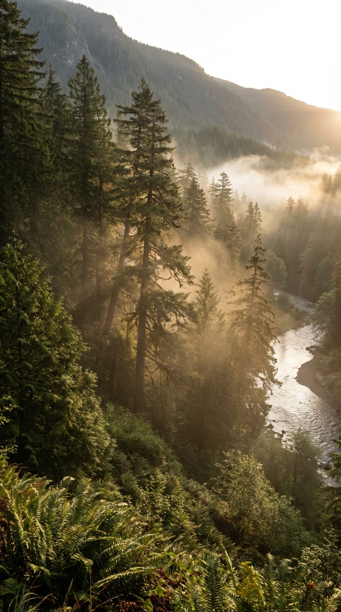
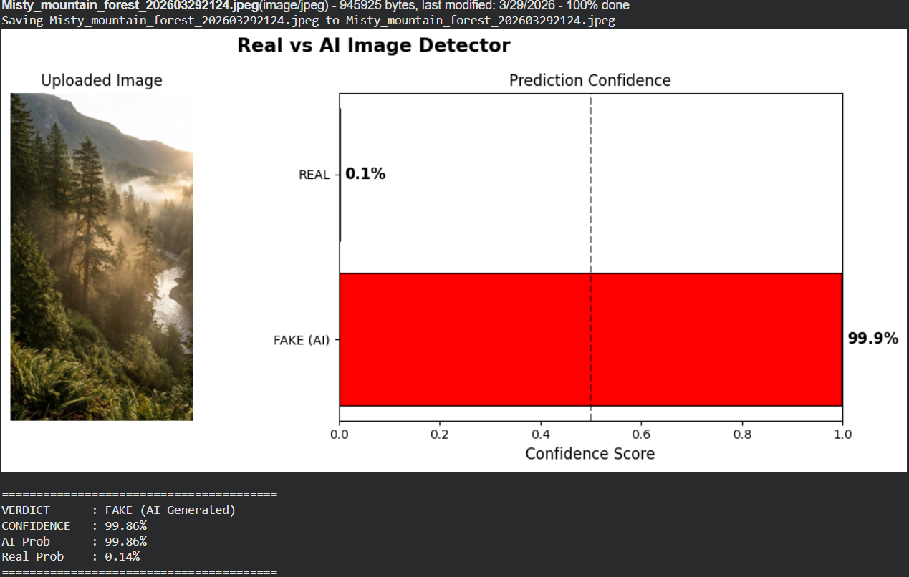
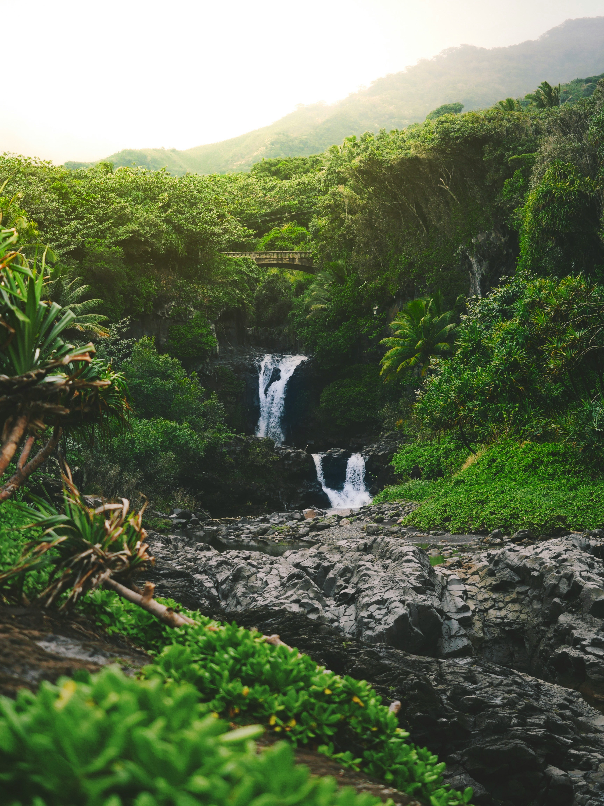
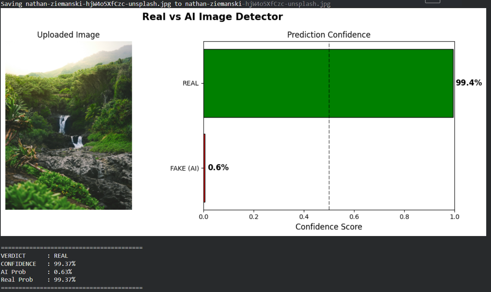
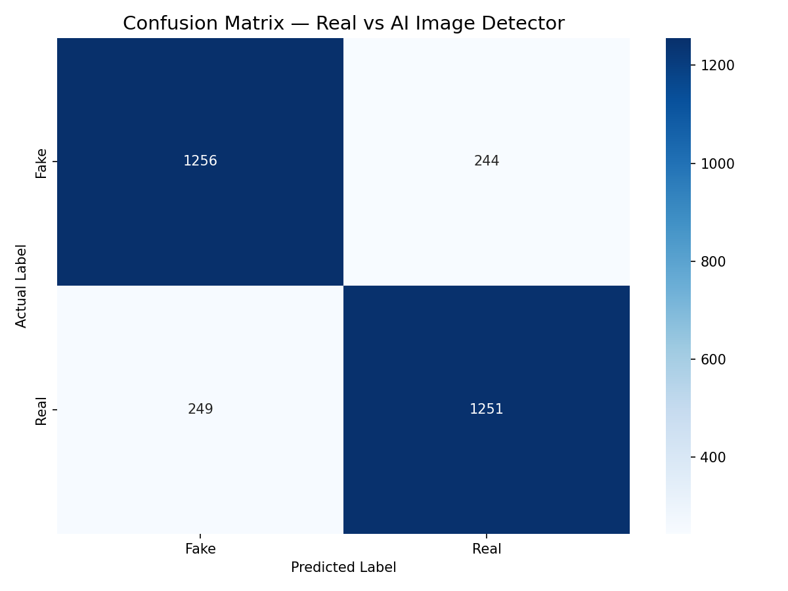
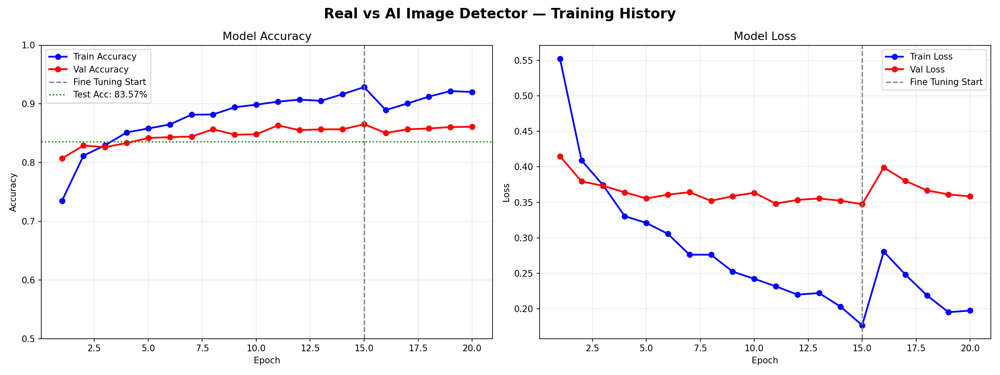

# 🔍 Real VS AI Image Detector


> With the rapid advancement of AI image generation technology, distinguishing real photographs
> from AI-generated images has become increasingly challenging — even for trained professionals.
> This project presents a deep learning solution to automate that detection.

---

## 📽️ Demo Video
> 🎬 **Demo video coming soon — currently being edited!**

---

## 🧪 Live Test Results

Two nature photographs. Both look real. Only one is.
The model identified each correctly with near-perfect confidence.

### Test 1 — AI Generated Image
> 📸 Image Source: **Nano Banana Pro** (AI Image Generator)

| Input | Prediction |
|---|---|
|  |  |

**Verdict: FAKE (AI Generated) — 99.86% confidence** 🔴

---

### Test 2 — Real Photograph
> 📸 Image Source: **Unsplash** — [nathan-ziemanski](https://unsplash.com/@nathanziemanski) (Free to use under Unsplash License)

| Input | Prediction |
|---|---|
|  |  |

**Verdict: REAL — 99.37% confidence** 🟢

---

> The AI-generated image was produced by Nano Banana Pro — one of the most advanced AI image
> generators available. Despite its photorealistic quality, the model detected it as fake
> with 99.86% confidence. The real photograph was correctly identified with 99.37% confidence.
> Both predictions were made on images the model had never seen before.

---

## 💡 The Idea Behind This Project

AI image generators have gotten frighteningly good. Tools like Midjourney, DALL-E, and Stable
Diffusion can produce images so realistic that even experts struggle to identify them. This is
no longer just a tech curiosity — it is a real problem affecting journalism, social media,
academic integrity, and digital trust.

The objective of this project is to develop a deep learning model capable of automatically
determining whether a given image is a real photograph or an AI-generated image — with high
confidence and across diverse image categories.

---

## 🔥 The Journey — 6 Attempts, 1 Working Model

### Attempts 1–5: Everything That Went Wrong

The first five attempts all shared the same fatal flaw — the model was learning the **wrong things**.

- Trained on CIFAKE (32×32 pixel images) — too small to learn meaningful visual patterns
- Models achieved decent accuracy during training but failed completely on real-world images
- Root cause: the model was picking up on surface-level shortcuts like brightness and contrast rather than genuine AI artifacts
- First dataset used only human faces — the model hit 98% accuracy on faces but completely broke on animals, food, and landscapes

Each failure pointed to the same underlying truth: detecting AI-generated images requires
looking at **deep, subtle visual features** — the kind that only emerge at high resolution
and across diverse image types.

### The Breakthrough: Transfer Learning + Better Data

Two decisions changed everything:

**1. Switched to EfficientNetB3** — Pre-trained by Google on 14 million images, this model
already understood complex visual patterns. Instead of teaching it everything from scratch,
the task was reduced to teaching it one new distinction: Real vs Fake.

**2. Switched to MS COCO AI Defactify Dataset** — A diverse, high-resolution dataset covering
faces, animals, objects, food, landscapes, and indoor scenes — generated by the most advanced
AI tools including Stable Diffusion, DALL-E 3, and Midjourney v6.

These two changes, combined with careful class balancing, produced a model that actually works.

---

## 📦 Dataset

**MS COCO AI — Defactify Image Dataset** (HuggingFace)

| Property | Details |
|---|---|
| Total Images | 96,000 across train, validation, and test |
| Image Types | Faces, animals, objects, food, landscapes, indoor scenes |
| AI Generators | Stable Diffusion 2.1, SDXL, SD3, DALL-E 3, Midjourney v6 |
| Class Balancing | Undersampled to 7,000 Real + 7,000 Fake = 14,000 training images |
| Resolution | High resolution — enough detail for deep feature learning |

---

## 🧠 Model Architecture

```
Input Image (224 × 224 × 3)
        ↓
EfficientNetB3 — Pre-trained Feature Extractor (ImageNet)
        ↓
Global Average Pooling
        ↓
Dense (256) + BatchNorm + Dropout 40%
        ↓
Dense (128) + BatchNorm + Dropout 30%
        ↓
Output — Sigmoid → Probability Score
        ↓
Score > 0.5 = REAL
Score < 0.5 = FAKE (AI Generated)
```

### Training Strategy

| Phase | What Happened | Validation Accuracy |
|---|---|---|
| Phase 1 | EfficientNetB3 frozen — top layers trained only | 86.52% |
| Phase 2 | Last 30 layers unfrozen — fine-tuned at low learning rate | 86.52% (stable) |

---

## 📊 Results

Tested on **3,000 completely unseen images** — never seen during training or validation:

| Metric | Value |
|---|---|
| Test Accuracy | **83.57%** |
| Validation Accuracy | **86.52%** |
| F1 Score | **0.84** |
| Precision — Fake | 83% |
| Precision — Real | 84% |
| Recall — Fake | 84% |
| Recall — Real | 83% |

### Confusion Matrix


### Training Curves


---

## 🛠️ How to Use

### Requirements
```bash
pip install tensorflow pillow numpy matplotlib requests
```

### Predict an Image
```python
from tensorflow.keras.models import load_model
from tensorflow.keras.applications.efficientnet import preprocess_input
from PIL import Image
import numpy as np

model = load_model("MyModel.keras")

def predict_image(image_path):
    IMG_SIZE = 224
    img = Image.open(image_path).convert("RGB").resize((IMG_SIZE, IMG_SIZE))
    img_array = preprocess_input(np.array(img, dtype=np.float32))
    img_input = np.expand_dims(img_array, axis=0)

    pred_prob = model.predict(img_input, verbose=0)[0][0]
    label = "REAL" if pred_prob > 0.5 else "FAKE (AI Generated)"
    confidence = pred_prob if pred_prob > 0.5 else 1 - pred_prob

    print(f"VERDICT    : {label}")
    print(f"CONFIDENCE : {confidence*100:.2f}%")

predict_image("your_image.jpg")
```

### Using with Google Colab + Google Drive
```python
from google.colab import drive
drive.mount('/content/drive')

from tensorflow.keras.models import load_model
model = load_model('/content/drive/MyDrive/AI_Model/MyModel.keras')
print("✅ Model loaded from Google Drive!")
```

---

## 📁 Project Files

| File | Description |
|---|---|
| `MyModel.keras` | Final trained model — ready for predictions |
| `best_model.keras` | Best checkpoint saved automatically during training |
| `confusion_matrix.png` | Visual breakdown of correct and incorrect predictions |
| `training_curves.png` | Accuracy and loss across all training epochs |
| `MyModel_Documentation.pdf` | Full project documentation |
| `Model_Reuse_code.txt` | Complete code to load and reuse the model |

---

## 💡 Key Lessons Learned

**Dataset quality beats dataset size.** Tiny 32×32 images simply don't carry enough visual
information. Resolution matters.

**Training data must match real-world use.** A model trained only on faces will fail on
everything else. The training distribution must reflect the intended use case.

**Class imbalance silently destroys models.** A 1:5 imbalance pushed the model to predict
Fake for everything. Balancing classes is a fundamental requirement, not an optional step.

**Transfer learning changes the game.** EfficientNetB3 solved in one session what five
scratch-built CNNs could not solve at all.

**Failure is data.** Every failed attempt revealed exactly what was wrong. The working model
exists because of those failures, not despite them.

---

## 🎓 Acknowledgements

This project was developed as the **Final Project** for an AI & Data Science Certificate Course.
Special thanks to [@veershah-sh](https://github.com/veershah-sh) and the entire teaching team
for their guidance, support, and for introducing the fundamentals of machine learning and
deep learning throughout this course.

---

## 👨‍💻 Author

**Ashish Bipinbhai Makwana**
BCA Student — Sardar Patel University, India
📅 March 2026

---

## 📄 License

This project is licensed under the **MIT License** — see the [LICENSE](LICENSE) file for details.
